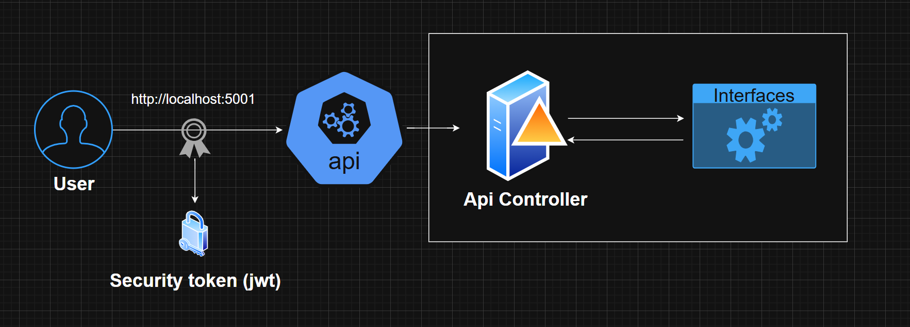

## Template.Api.Net9
This folder contains the main API project with all controllers and configurations. It serves as the core application for client interactions.<br>
This is a copy of my Template.Api.Net8: https://github.com/agustinafassina/TemplateApi.Net8

## 📄API Reference
### Diagram 


### 🔐 Authorization
It implements JWT authentication to secure endpoints, validating issuer, audience, and signature, allowing access only to authorized users.
```
[Authorize(AuthenticationSchemes = "Auth0App1")]
[Authorize(AuthenticationSchemes = "Auth0App2")]
```
Environment variables setting (auth0 in this case)
```
  "Auth0App1": {
    "Issuer": "https://test.asdasdasd.auth0/",
    "Audience": "Test-Api"
  },
  "Auth0App2": {
    "Issuer": "AgusFassina",
    "Audience": "Agusfassina"
  }
```

### 🛠️Dotnet build and run
```
dotnet build
dotnet run
```

### 🛠️Docker build and run

```
# Docker build
docker build -f Dockerfile -t api .
# Docker run in the port 8787
docker run -d -p 8787:80 -e "ASPNETCORE_ENVIRONMENT=Development" --name api api
# api tests http://localhost:8787/swagger/index.html
```


